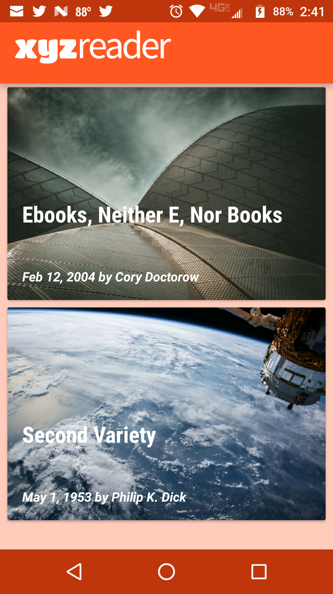

# XYZReader
A mock RSS feed reader featuring banner photos and headlines

The starting point for this project can be found [here.](https://github.com/udacity/xyz-reader-starter-code)
Your job will be to take the user feedback in the UI Review node, and implement changes that will improve the UI and make it conform to Material Design.

## User Feedback
#### Lyla says:
“This app is starting to shape up but it feels a bit off in quite a few places. I can't put finger on it but it feels odd.”
#### Jay says:
“Is the text supposed to be so wonky and unreadable? It is not accessible to those of us without perfect vision."
#### Kagure says:
“The color scheme is really sad and I shouldn't feel sad.”

## Project Rubric
* App uses the Design Support library and its provided widget types (`FloatingActionButton`, `AppBarLayout`, `SnackBar`, etc).
* App uses `CoordinatorLayout` for the main Activity.
* App theme extends from `AppCompat`.
* App uses an 'AppBar' and associated `Toolbar`s.
* App provides a Floating Action Button for the most common action(s).
* App properly specifies elevations for app bars, FABs, and other elements specified in the [Material Design specification](http://www.google.com/design/spec/material-design/introduction.html).
* App has a consistent color theme defined in `styles.xml.` Color theme does not impact usability of the app.
* App provides sufficient space between text and surrounding elements.
* App uses images that are high quality, specific, and full bleed.
* App uses fonts that are either the Android defaults, are complementary, and aren't otherwise distracting.
* App conforms to common standards found in the [Android Nanodegree General Project Guidelines](http://udacity.github.io/android-nanodegree-guidelines/core.html).

## Color Theme

For the theme colors, the objective was to match the application logo. This logo was provided within the base application project.

Using the Logo, I implemented the color scheme as follows:
* Primary Color: #ff5722 - Application Bar
* Primary Light: #ffccbc - Background for both the Main Activity and Detail Page
* Primary Dark : #bf360c - Action and Notification bars
* Accent Color : #00c853 - Share Icon

## Screen Shots Before & After
### Main Activity
<table>
  <tr>
  <th>Before</th>
  <th>After</th>
  </tr>
  <tr>
  <td></td>
  <td></td>
  </tr>
</table>

### Article Details
<table>
  <tr>
  <th>Before</th>
  <th>After</th>
  </tr>
  <tr>
  <td></td>
  <td></td>
  </tr>
</table>

### Shared Transitions
Performing a transition from one activity to another, seems to be fairly easy, which it is. Add in the complexity of using a ViewPager and it becomes a little more complicated. Upon a little research I came across [this article.](http://www.androiddesignpatterns.com/2015/03/activity-postponed-shared-element-transitions-part3b.html) In addition to the article, I also downloaded the code from [this GitHub repository.](https://github.com/alexjlockwood/adp-activity-transitions)

I will not lie, I went over the document and the code several times, in order to get this to work correctly. In the end, I was able to get the shared transistions to work properly.

<image src="singlePageTransition.gif" alt="Shared Transition">
<image src="changePageTransition.gif" alt="Shared Transition">

### Future Imporvements
* Include Title and Author in the Shared Transisitions
* Break the Article from one single TextView, into multiple TextViews and add as a NestedScrollView.
